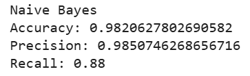
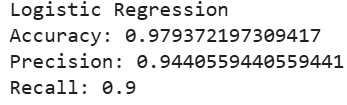
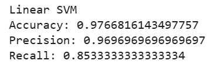
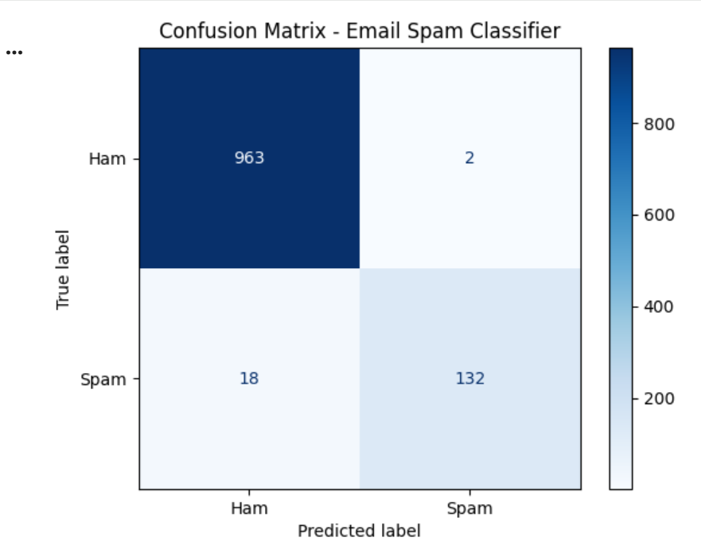

# 📧 Email Spam Classification using Machine Learning

## 📌 Project Overview
This project implements an NLP-based email spam classification system using machine learning techniques to classify emails as Spam or Ham.

## 🚀 Features
- Text preprocessing using regular expressions
- TF-IDF feature extraction with n-grams
- Model comparison:
  - Naive Bayes
  - Logistic Regression
  - Linear SVM
- Performance evaluation using accuracy, precision, recall, and confusion matrix

## 🧠 Models & Results

| Model | Accuracy | Precision | Recall |
|------|----------|-----------|--------|
| Naive Bayes | 98.2% | 98.5% | 88% |
| Logistic Regression | 94.3% | 97.8% | 58.7% |
| Linear SVM | 97.7% | 97.0% | 85.3% |

## 📊 Result Visualizations

### 🔹 Naive Bayes Results

### 🔹 Logistic Regression Results

### 🔹 Linear SVM Results

### 🔹 Confusion Matrix

## 🛠️ Tech Stack
- Python
- Pandas, NumPy
- Scikit-learn
- NLP (TF-IDF)

## 📂 Dataset
Public email spam dataset with ham and spam labels.

## ▶️ How to Run

### 1. Install dependencies
    pip install -r requirements.txt

### 2. Open the Jupyter Notebook
    notebook/project_spam.ipynb

### 3. Run the notebook cells step by step to:
- Preprocess the dataset
- Train and compare models
- Evaluate performance
  
## 📌 Conclusion
Naive Bayes achieved the best balance between precision and recall for this dataset, while Linear SVM also showed strong performance. Logistic Regression required additional tuning to improve recall.

## 🙌 Author
Putti Bhavani  
AI & ML Student
